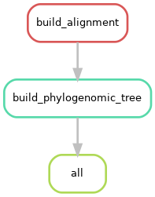

# phylogenome workflow

### Description of workflow
- Construction of phylogenomic tree using gtotree
	- Accession IDs of Methylomirabilales order outgroup:
		| Accession   | Taxonomic description      |
		|-------------|----------------------------|
		| ASM304403v1 | Methylomirabilis limnetica |
		| ASM9116v1   | Methylomirabilis oxyfera   |