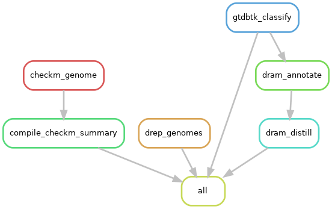

# preliminary workflow

This workflow is semi-automatic.

### Manual curation
Genomes and metadata files downloads are done using scripts in `src` folder (genomes from NCBI), or downloaded directly from databases (primarily from IMG MER). Once done, then the genome files (with `fasta` extension) are placed into directory `input_folder/genomes`, and metadata files into `input_folder`.

Some metadata information will probably have to be obtained manually (such as location, habitat, publication, etc etc).

### Streamlined workflow
After compilation of all genome files, then the workflow will proceed with:
- Dereplication using `drep`
	- Genomes are dereplicated to identify genome clusters
	- Genomes that deviate far away from other genomes are suspected to be of different taxa
- Taxonomic annotation using `gtdbtk`
	- The taxonomic annotation information will be used to fill in the finalised metadata
	- Also to confirm if downloaded genomes are assigned as expected taxa
	- This will be applied to only dereplicated genomes - closely related taxa are expected to be of similar taxonomic assignment, at genus/species level
- Check genome completion and contamination with `checkm`
	- This applies to all genomes
	- Completion and contamination results are used later as metadata
	- Only medium/high quality MAGs/SAGs are to be considered for other subsequent workflows
- Find general metabolic processes being carried out
	- Applies to all genomes

### Finally
- Finalise input genomes and metadata
- Subsequent workflows will utilise either dereplicated set or all genomic set, depending on research question

### Notes
- To ensure smooth downstream analyses, all genome files have a ".fasta" suffix, and will the filenames will need to begin with an alphabet, and NO SYMBOLS